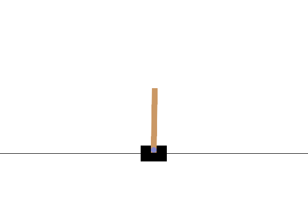

# Deep Q-Network (DQN) Implementation for CartPole-v1



This repository contains a PyTorch implementation of **Deep Q-Network (DQN)** to solve the OpenAI Gym `CartPole-v1` environment.
(skipped ch4~ch6 part)


## Project Overview
The goal of this project is to implement a reinforcement learning agent capable of balancing a pole on a cart. The agent learns an optimal policy directly from high-dimensional sensory inputs using end-to-end reinforcement learning.


**Algorithm**: Deep Q-Network (DQN) with Experience Replay & Target Network
**Environment**: OpenAI Gym `CartPole-v1`
**Framework**: PyTorch


## Experimental Results & Analysis


### Training Log Snippet
During the training phase, the agent showed significant performance improvements. Below is a log snippet from the convergence phase:

```text
Episode: 660 | Train Score: 137.8 | Real Test: 181.0 | Eps: 0.20
Episode: 680 | Train Score: 139.2 | Real Test: 859.0 | Eps: 0.20
Episode: 700 | Train Score: 142.8 | Real Test: 159.0 | Eps: 0.20
...
Episode: 800 | Train Score: 218.7 | Real Test: 587.0 | Eps: 0.18 (Solved / Infinite Loop)
```

### Key observation 
Performance instability (Catastrophic forgetting)
   - Observation : A sharp performance drop was observed at Episode 700 (Score: 159.0) immediately after achieving a high score at Episode 680 (Score: 859.0).
   - Analysis: This phenomenon typically indicates Catastrophic Forgetting or instability caused by Target Network Updates.
               As the agent learns new experiences to handle specific states (e.g., recovering from extreme (-) angles), the shared weights
               of the neural network may degrade the performance on previously mastered states (e.g., recovering from (+) angles)


## How to Run
Open DQN_Cartpole.ipynb in Google Colab
               
